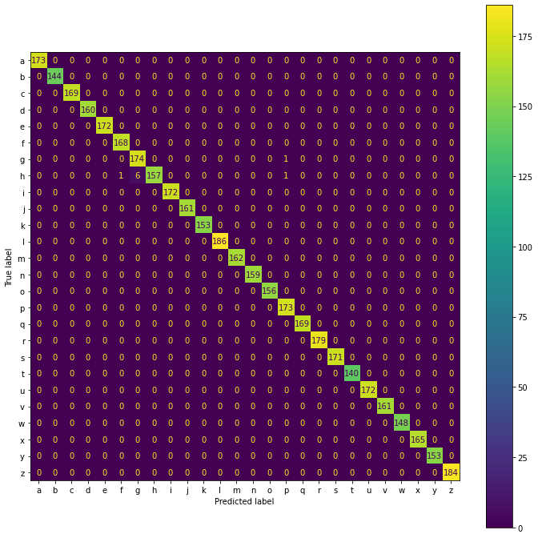

# LIS-Detection
In this repository has been implemented an algorithm to identify the italian sign language (LIS - Lingua Italiana dei Segni) through [Opencv](https://opencv.org/), [Mediapipe Hand Detection](https://developers.google.com/mediapipe/solutions/vision/hand_landmarker) and a [K-nn classifier](https://scikit-learn.org/stable/modules/generated/sklearn.neighbors.KNeighborsClassifier.html).

## :hammer: Technologies

- Python 3.8
- Mediapipe
- Opencv
- Sklearn
- Pickle

## :bar_chart: Dataset

Dataset was acquired using a previously created tool: [acqTool](https://github.com/xandrew94x/acqTool)

With _acqTool_ 26 classes were recorded, using alphabet letters of italian sign language. 

All classes are balanced, with up to **500** items each.

Finally the dataset was normalized using the MinMaxScaler [0,1].

_Note: only right hand was used during the acquisition._

## :children_crossing: Classifier

Using _sklearn_ the classifier chosen for this project was the **K-NN**.

With balanced classes the result is very good: 



## :rocket: Launch

```
python hand_detection_main.py -c {classifier.pkl}
```

## :page_facing_up: License

This project is released under the [GNU General Public License v3.0](LICENSE)

